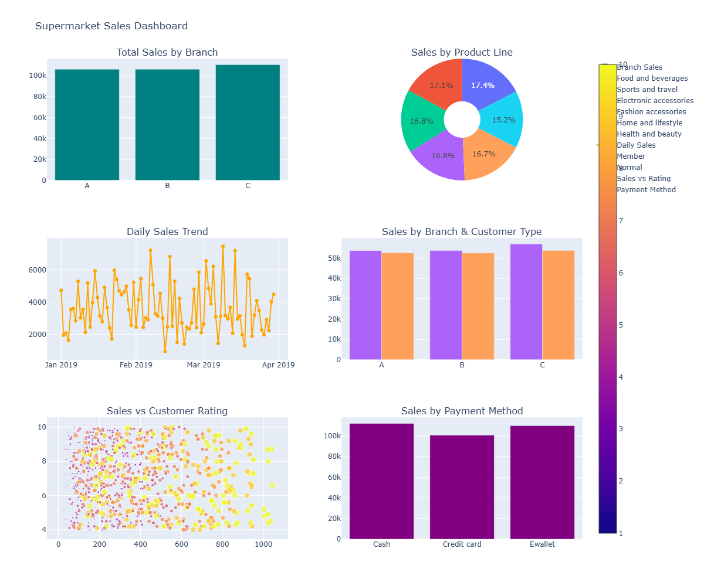
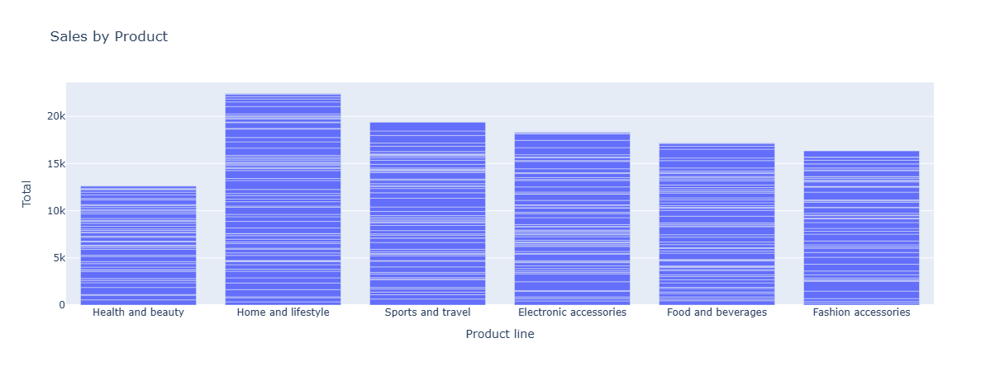
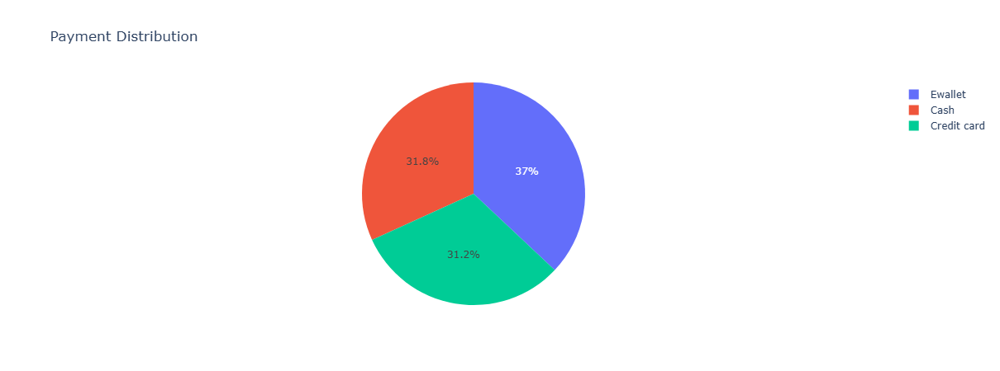
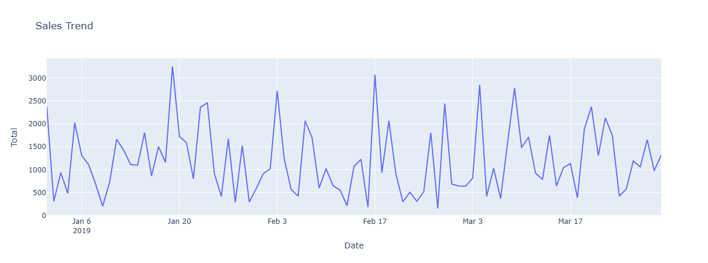
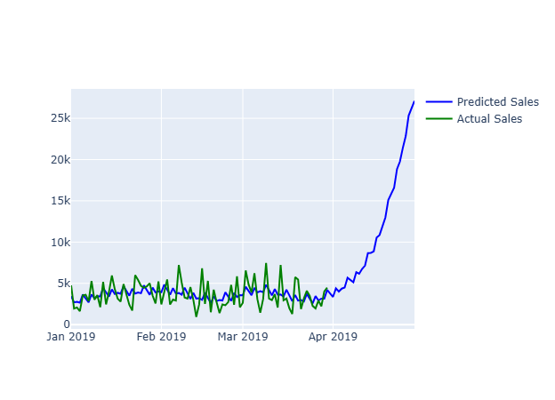
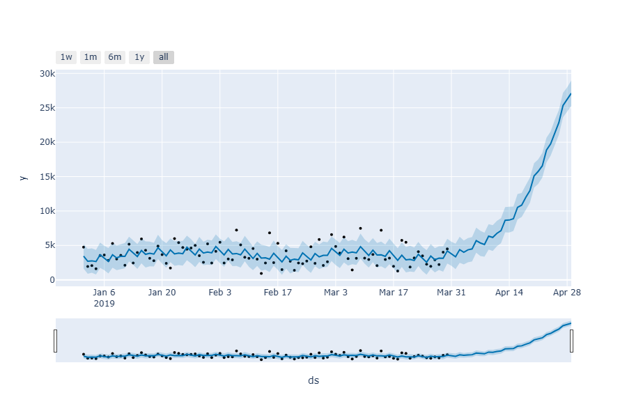

# 🛒 Walmart Sales Analysis Dashboard

## 📌 Project Overview

This project presents an **end-to-end data analysis and dashboard solution** using Walmart sales data.
The goal is to extract **business insights, visualize trends, and predict future sales** using Machine Learning.

---

## 🚀 Key Features

* 📊 Interactive Dashboard using Dash
* 🔍 Data Cleaning & Exploratory Data Analysis (EDA)
* 📈 Sales Trend Analysis
* 🛍️ Product Line Performance Analysis
* 💳 Payment Method Insights
* ⭐ Customer Rating Analysis
* 🔮 Sales Forecasting using Prophet
* 🤖 Sales Prediction using Random Forest
* 📌 KPI Metrics (Sales, Profit, Transactions)

---

## 📂 Dataset Description

The dataset contains retail transaction data including:

* Branch, City
* Customer Type, Gender
* Product Line
* Unit Price, Quantity, Total Sales
* Payment Method
* Date & Time
* Rating

---

## 🛠️ Tech Stack

* Python 🐍
* Pandas & NumPy
* Plotly
* Dash
* Scikit-learn
* Prophet

---

## 📊 Dashboard Screenshots

| Dashboard             | Sales                 | Product               |
| --------------------- | --------------------- | --------------------- |
|  |  |  |

| Payment               | Trend                 | Forecast              |
| --------------------- | --------------------- | --------------------- |
|  |  |  |

| Customer Insights     |
| --------------------- |
|  |

---

## ⚙️ Installation

```bash
pip install pandas plotly dash scikit-learn prophet
```

---

## ▶️ Run the Application

```bash
python app.py
```

Then open:
http://127.0.0.1:8050/

---

## 📈 Key Insights

* 🛍️ Top-performing product line
* 🏪 Best-performing branch
* 📅 Peak sales days
* 💳 Payment trends
* ⭐ Customer satisfaction

---

## 🔮 Future Improvements

* Add more filters
* Deploy dashboard online
* Improve UI design

--

**Dhanalakshmi J**
🔗 https://github.com/dhanam755

---

⭐ If you like this project, give it a star!
